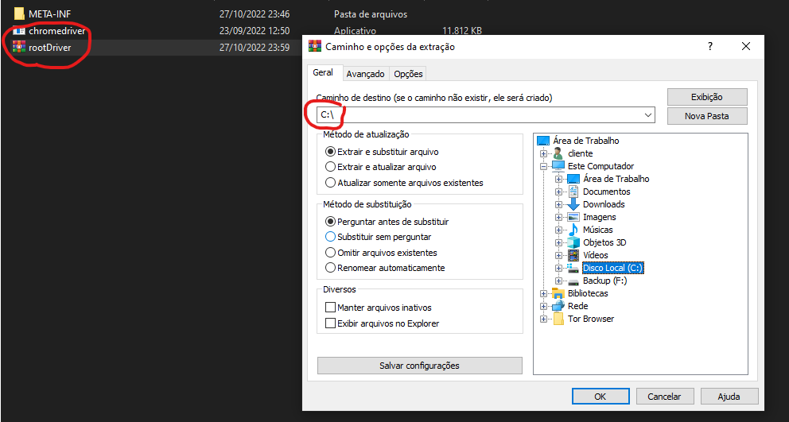

# BotRoyal

Robo para whatsapp  !  

---

- ## Definição do projeto

- Nome : Bot Royal
- Descrição : Automação de envio de mensagem para varios contatos.
- Objetivo : Enviar mensagens para varios contatos no whatsapp de forma automatizada.


- ### Definição da tecnologia

        1. Java
        2. Selenium 
        3. Swing GUI

- ### Requisitos

        1. Ter instalado em sua máquina alguma IDE Java.
        2. Gitbash
        3. JDK versão 18
        4. Winrar

---

- ## Executar projeto

 1. Clone este repositorio em sua maquina utilizando o gitbash:

```bash

 git clone "https://github.com/giovanesantiago/BotRoyal.git"

```

2. Abra a pasta do projeto e siga o diretorio untitled\src\main\resources

3. Extraia p arquivo "rootDriver" para C:



4. Abra o executavel JAR dentro da pasta C:\rootDriver\botRoyal_jar

5. Ou abra o projeto na sua IDE de preferencia e execute o projeto pela Classe principal App.
